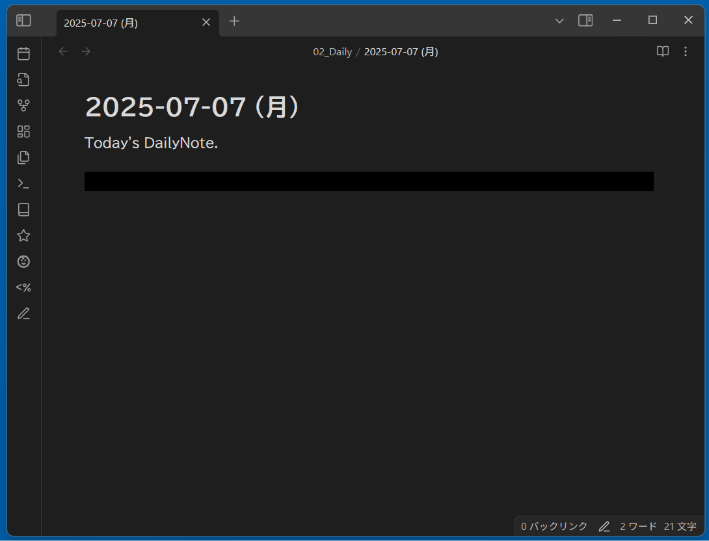

# "LongtimeDiary" for Obsidian

This is a Obsidian plugin for helping you to look back on past on this day in the Daily Note.

By adding a specific code block to the Daily Note, this plugin will search and display the Daily Note for the same day of the month as the Daily Note date.  
This plugin is a must-have for long-time diary keepers on Obsidian.

## Installation
In the process of applying.  
Those who wish to use it ahead of time should install it using [BRAT](https://github.com/TfTHacker/obsidian42-brat).
1. ~~Find the under "LongtimeDiary" in the community plugins list in Obsidian~~
2. ~~Click "Install" and "Enable"~~

## Usage

Please write the following code block in the Daily Note.  
If you put it in other than the Daily Note, it will not work.

> &#96;&#96;&#96;LongtimeDiary  
> &#96;&#96;&#96;

I recommend that you include this code block in your Daily Note template.

## License
This project is licensed under the MIT License.
